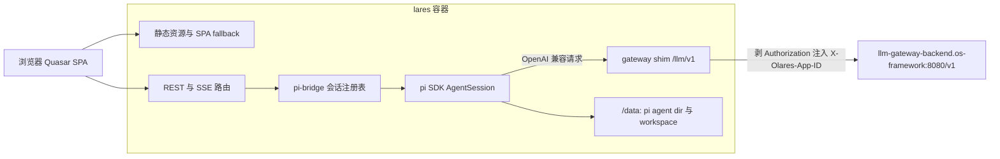

# Lares: pi 编码 Agent 的 Olares 应用

日期: 2026-07-26
状态: 已批准，进入实现

## 1. 背景与目标

把 [pi 编码 agent](https://github.com/badlogic/pi-mono) 打包成一个 Olares 应用：单个 Docker 镜像，内含一个嵌入 pi SDK 的 Node 后端和一个 Quasar 单页应用，安装后用户在浏览器里就能用上编码 agent，无需在终端里配置模型。

成功标准：

- 用户从 Olares 市场安装应用，打开入口，不做任何配置就能开始对话。
- 功能上对齐 [pi-web](https://github.com/agegr/pi-web)：会话浏览、实时对话、文件预览、模型与技能配置。
- 模型默认走 Olares 自带的 llm-gateway。

非目标：

- 不做多用户与账号体系。Olares 平台负责登录与入口，应用内是单用户单实例。
- 不做 pi 上游的功能增强。上游有能力缺口时，在应用侧绕过或另行给上游提 issue。

## 2. 已验证的技术约束

这些结论来自对 pi-mono、pi-web、llm-gateway 三个仓库的实际阅读，是后续所有设计决策的地基。

### 2.1 pi 的集成方式是 SDK 嵌入，不是驱动二进制

pi-web 并不 spawn `pi` 进程。它在 Next.js 的 Node 进程里直接 `import` pi 的 npm 包，调用 `createAgentSessionFromServices()` 造出 `AgentSession` 对象，浏览器通过 REST 下命令、通过 SSE 收事件。核心在 `pi-web/lib/rpc-manager.ts` 的 `startRpcSession()`。

本项目沿用同样的做法。pi 也提供 `pi --mode rpc` 子进程协议，但那会多一层进程边界和 JSON 序列化，且拿不到 SDK 才有的 `SessionManager` / `ModelRuntime` 等对象，得不偿失。

包的 scope 用 `@earendil-works/pi-*`（pi-web 在用的活跃分支，npm 最新 0.82.1），不是 `@mariozechner/pi-*`（0.73.1）。

### 2.2 pi 没有配置默认模型的环境变量

pi 只从环境变量读各家 provider 的 API key（`ANTHROPIC_API_KEY`、`OPENAI_API_KEY` 等）。默认模型来自 `settings.json` 的 `defaultProvider` / `defaultModel`；自定义 OpenAI 兼容端点来自 `models.json` 的 `providers`。两个文件都在 `PI_CODING_AGENT_DIR`（默认 `~/.pi/agent`）下。

所以「通过环境变量把模型配好」的落地方式是：容器启动时由 bootstrap 逻辑按环境变量渲染这两个文件。

pi 的 provider 配置字段够用：`baseUrl`、`api`、`apiKey`、`headers`、`authHeader`，其中 `apiKey` 和 header 的值可以写成环境变量名，由 pi 在运行时解析。

### 2.3 pi 直连 gateway 无法使用 X-Olares-App-ID 懒认证

llm-gateway 的数据面有两条互斥的认证路径：带 `Authorization: Bearer sk-...` 的用户 key，或者不带 Authorization、只带 `X-Olares-App-ID` 的懒 app 身份。后者对应用最友好，零配置。

但这条路对 pi 不通，原因是两边的硬约束正好对撞：

- pi 的 `openai-completions` provider 用官方 openai-node SDK，`apiKey` 必填（缺失直接抛错），而该 SDK 一定会发 `Authorization: Bearer <key>`。
- gateway 的 `DataPlaneAuth` 中间件只要看到 `Authorization != ""` 就进 Bearer 分支，空 token 返回 401 `malformed_bearer`，明确不回退到 app 分支。

因此需要在容器内加一层 shim：pi 指向 `127.0.0.1` 上的本地路由，shim 剥掉 Authorization、注入 `X-Olares-App-ID`，再转发到 gateway。

备选方案与放弃理由：

- 改 gateway 接受哨兵 Bearer（如 `Bearer olares-app:<name>`）：更彻底，能一次性解决所有 OpenAI SDK 客户端的同类问题，但需要改另一个仓库并等它发版，会阻塞本项目。作为给 gateway 的独立改进项记录，不纳入本设计。
- 写 pi extension 用 `registerProvider` + 自定义 `streamSimple` 完全接管请求：省掉一次网络跳转，但要自己维护一份 OpenAI 流式解析实现，长期维护成本高于一个几十行的代理。

### 2.4 gateway 的 /v1/models 缺少模型能力元数据

`GET /v1/models` 每条只返回 `id`、`object`、`created`、`owned_by`、`qualified_id`。pi 的模型定义还需要 `contextWindow`、`maxTokens`、`reasoning`、`input`（是否支持图片）。

处理方式：同步时用 pi 的默认值（128000 / 16384 / 不支持推理 / 纯文本），用户可在模型配置面板里逐个改并持久化到 `models.json`。后续如果 gateway 愿意在 `/v1/models` 里带上 `model_spec`，同步逻辑可以无缝升级。

## 3. 架构



一个进程同时承担四件事：托管 SPA 静态资源、提供 REST 与 SSE、持有 pi 会话、给 pi 当 LLM 代理。单用户场景下这样最简单，也让 shim 的地址天然是 `127.0.0.1`。

## 4. 代码单元

npm workspaces monorepo，三个包加两个部署目录。

### packages/shared

前后端共用的类型：RPC 命令联合类型、SSE 事件类型、配置 schema。事件类型从 pi 包 re-export，避免手写一份会漂移的副本。

依赖：pi 的 npm 包（仅类型）。

### packages/server

Hono + TypeScript ESM。

- `pi-bridge/` — 会话注册表与 `AgentSessionWrapper`。职责是：按 sessionId 持有 pi 会话对象、把 REST 命令翻译成 `AgentSession` 方法调用、把 SDK 事件广播给所有订阅者、空闲超时回收。移植自 pi-web 的 `rpc-manager.ts`。
- `routes/agent.ts` — 会话生命周期与事件流。
- `routes/sessions.ts` / `models.ts` / `files.ts` / `skills.ts` / `git.ts` — 其余 REST 面。
- `gateway-shim/` — `/llm/v1/*` 反向代理，以及 `GET /api/gateway/models` 模型同步。
- `config/bootstrap.ts` — 启动时渲染 `models.json` 与 `settings.json`。
- `static.ts` — 托管 SPA 构建产物，带 history fallback。

对外契约与 pi-web 保持一致（路径、请求体、SSE 事件形状），这样前端可以独立替换，也便于对照排错。

### packages/web

Quasar SPA：Vue 3 + Quasar 2 + Pinia + TypeScript。组件与 pi-web 一一对应：AppShell、SessionSidebar、ChatWindow、ChatInput、MessageView、ModelsConfig、SkillsConfig、FileExplorer、FileViewer。

选 Quasar 的另一个理由是 llm-gateway 的 admin UI 也是 Vue 3 + Quasar 2，两个仓库的前端约定可以互相借鉴。

### docker/

多阶段 Dockerfile：构建阶段编译 web 与 server，运行阶段用 node:22-slim，额外装 git、ripgrep、fd（pi 的工具链依赖）。`entrypoint.sh` 负责建目录、设权限、起进程。

### chart/

Olares chart 与 `OlaresManifest.yaml`：声明入口、端口、持久化卷。

## 5. 数据流

### 5.1 发一条消息

1. 浏览器 `POST /api/agent/new`，带 `cwd` 与首条命令；后端创建 `AgentSession`，返回真实 sessionId。
2. 浏览器 `GET /api/agent/:id/events` 建立 SSE，首帧是 `{ type: "connected", sessionId }`。
3. 后续消息走 `POST /api/agent/:id`，请求体是带 `type` 字段的命令对象，立即返回，结果通过 SSE 推送。
4. pi 内部调用 LLM 时请求 `http://127.0.0.1:$PORT/llm/v1/chat/completions`，shim 转发到 gateway 并流式回传。

### 5.2 配置引导

容器启动 → 读环境变量 → 若 `models.json` 缺少 `olares` provider 则写入 → 若 `settings.json` 没有默认模型则写入 → 启动 HTTP 服务。

引导逻辑只补缺失的键，不覆盖用户在 UI 里改过的值，这样重启不会丢配置。

## 6. 环境变量契约

- `PORT` — 默认 `30141`
- `PI_CODING_AGENT_DIR` — 默认 `/data/pi/agent`
- `LARES_WORKSPACE` — 默认 `/data/workspace`
- `LLM_GATEWAY_URL` — 默认 `http://llm-gateway-backend.os-framework:8080/v1`
- `OLARES_APP_ID` — shim 注入的 `X-Olares-App-ID` 值
- `LARES_GATEWAY_API_KEY` — 可选；给出时 shim 改发 `Authorization: Bearer`，走用户 key 路径
- `PI_DEFAULT_MODEL` — 可选，形如 `provider/id`
- `PI_SKIP_VERSION_CHECK` — 容器内固定为 `1`

渲染出的 `models.json`：

```json
{
  "providers": {
    "olares": {
      "baseUrl": "http://127.0.0.1:30141/llm/v1",
      "api": "openai-completions",
      "apiKey": "olares",
      "models": [{ "id": "default" }]
    }
  }
}
```

`apiKey` 是占位值，shim 会丢弃。之所以不留空，是因为 pi 要求该字段非空。

## 7. 错误处理

- gateway 不可达：shim 返回 502 并带上原始错误文本，pi 会把它作为 provider 错误抛给会话，前端在消息流里展示。
- gateway 返回 401：多半是 `X-Olares-App-ID` 没被平台注入或 app 被停用。shim 识别这类响应，在错误体里附上排查提示，避免用户只看到一句 invalid api key。
- 会话文件损坏：pi 的 `SessionManager` 自身容忍坏行，后端不额外处理，只在列表接口里跳过读不出 header 的文件。
- SSE 断线：前端自动重连，重连后先拉一次 `get_state` 对齐状态，不依赖事件回放。

## 8. 测试策略

- `packages/server` 用 vitest 做单元测试，重点覆盖三块纯逻辑：配置引导的合并语义、shim 的请求头改写、模型同步的字段映射。
- pi-bridge 的会话生命周期用一个假的 AgentSession 做契约测试，不打真实 LLM。
- 端到端验证放在真机：装到 Olares 上，确认能经 shim 完成一次对话。这一步无法在开发机模拟，因为 `os-framework` 命名空间只在真实集群里存在。

## 9. 分期

每期结束都是一个可部署到 Olares 的里程碑。

1. 骨架直通：monorepo、后端、shim、bootstrap、Dockerfile、chart、最小聊天页。验收标准是装到 Olares 上能对话。
2. 聊天对齐：流式输出、工具调用渲染、Markdown/Mermaid/KaTeX、图片、steer 与 follow-up、abort、队列、压缩、上下文占用。
3. 会话管理：按项目分组列表、分支树、fork、从某条消息重开、重命名与删除、HTML 导出。
4. 文件：文件树、源码与 diff 与图片与音频与 PDF 与 DOCX 预览、`@` 文件索引、git status 与 diff。
5. 配置面板：模型配置与 gateway 同步、API key 与 OAuth、skills、plugins、thinking 级别、工具开关。
6. worktree 与整体打磨。

## 10. 真机验证结果（2026-07-26）

第 1 期在 `uranusflare@olares.com`（Olares 1.12.6-rc.2，amd64 单节点）上跑通。

集群上还没有 llm-gateway，所以把 `LLM_GATEWAY_URL` 指向同一集群里已装的 llama.cpp 共享应用
`http://sharedentrances-api.llamacppqwen3627bmtpq4kxlv3-shared:80/v1`。它同样是 OpenAI 兼容端点，
除了 gateway 特有的鉴权语义之外，链路的每一环都被真实覆盖到了。

验证到的：

- 镜像以 uid 1000 跑起来，appData 落盘，会话 jsonl 写在 `/data/pi/agent/sessions/` 下
- 入口反代 → SSE → pi SDK → shim → 集群内端点，一次完整对话拿到 thinking 与正文，用时约 40 秒，
  证明 `options.apiTimeout: 0` 确实解掉了 15 秒截断
- `/api/gateway/sync-models` 从上游发现模型并写回 `models.json`

还没验证的只有一件事：gateway 自己的 `X-Olares-App-ID` 懒注册。它得等 gateway 装进 `os-framework`
才能测。shim 剥 `Authorization` 的行为有单元测试兜着，但真机上 gateway 认不认这个身份仍是未知数。

期间踩到一个坑：`{{ .Values.userspace.appData }}/lares` 这个子目录由 `DirectoryOrCreate` 创建，
属主是 root，uid 1000 的进程写不进去，容器起不来。修法是加一个 busybox initContainer 把目录 chown
过来；chown 前先判断属主，否则升级时 root 去 chown 一个已经属于 uid 1000 的目录会 EPERM。

## 11. 风险

- `X-Olares-App-ID` 由谁注入、gateway 是否认这个身份，仍需等 gateway 上线后验证。
- pi SDK 迭代很快，版本必须锁死，升级单独走一次并跑回归。
- 复刻 pi-web 的工作量集中在前端，约 16000 行 React 需要翻译成 Vue。分期交付是为了让每一期都能独立验收，而不是攒一个大版本。
