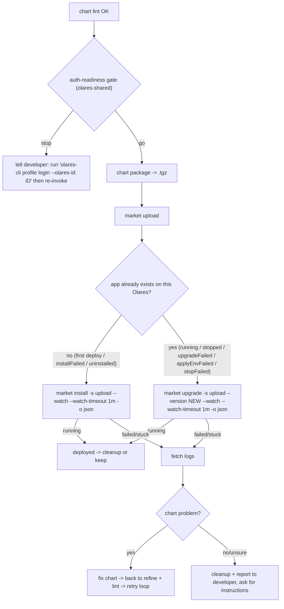

# Deploy to your Olares: upload, run, and diagnose

> **Prerequisite:** read the parent [`../SKILL.md`](../SKILL.md) first; pass `chart lint` before starting any of this.
> This is the **deploy** capability — the done step of the two axes. Unlike `from-compose` / `lint`, **everything here talks to a running Olares and REQUIRES login** — first read [`../../olares-shared/SKILL.md`](../../olares-shared/SKILL.md) for the profile model, login flow, and auth-error recovery.

> **Automation model: automatic after `lint` passes.** Once `lint` is green and the profile clears olares-shared's [auth-readiness gate](../../olares-shared/SKILL.md#auth-readiness-gate), drive the whole loop without asking: package → upload → install → watch → diagnose → fix → retry. Stop only when the gate says stop, or when a failure is clearly **not** a chart problem. Inspect the app's workloads in parallel from the moment install/upgrade begins; never wait on the coarse market row alone (see [§3 Don't just wait](#dont-just-wait--diagnose-the-apps-own-pods-in-parallel)).

`lint` proves the chart is structurally valid, not that the app pulls its images, wires its middleware and reaches `running`. This loop proves that, by pushing the chart to the developer's Olares and watching it install.



## 1. Is the CLI logged in?

Run `olares-cli profile list` and apply olares-shared's [auth-readiness gate](../../olares-shared/SKILL.md#auth-readiness-gate): `logged-in` / `expired` → **go** (an `expired` token auto-refreshes on the first call — not a reason to stop); `invalidated` / `never` → **stop**. When it says stop, **do NOT log in on the developer's behalf unilaterally** — tell them local `lint` passed and that deploy needs `olares-cli profile login --olares-id <id>` first, and stop unless they ask you to drive the login (then follow olares-shared's agent-driven login flow).

## 2. Package + upload (automatic — no confirmation needed)

`lint` passed and the profile cleared the auth-readiness gate — proceed immediately. **Bump the version on every (re)upload:** before packaging, bump `Chart.yaml` `version` and `OlaresManifest.yaml` `metadata.version` together (`lint` enforces that they are equal), a patch bump by default. Market's gate only requires `>=` the stored version, but a strictly-newer number keeps uploads distinct and `upgrade --version` unambiguous. (Same-version overwrite is the fallback when the chart didn't change — see §3.)

`market upload` takes a `.tgz` / `.tar.gz`, not a raw chart directory, so package first with the built-in verb (no `helm` binary needed):

```bash
olares-cli chart package ./<app>                 # -> <app>-<version>.tgz (name/version from Chart.yaml; add -o ./dist to choose a dir)
olares-cli market upload ./<app>-<version>.tgz   # use the new <version> in the filename
```

- `chart package` mirrors `helm package` and preserves `OlaresManifest.yaml`, so the archive is accepted as-is by both `chart lint` and `market upload`. A bumped version yields a new `<app>-<version>.tgz` name: pass that name to `upload` and the new number to `install` / `upgrade --version`.
- `upload` always lands the chart in the `upload` source (see [`../../olares-market/SKILL.md`](../../olares-market/SKILL.md)). `-s` is intentionally not exposed.
- Upload runs the server-side ingest, so a chart that passed local `lint` can still be rejected here (e.g. cluster-specific checks). Surface that message as a chart problem and go back to refine.
- Nothing left locally to package? `market download <app>` pulls the stored `.tgz` back — never re-author a chart the Olares still holds (the [`olares-market`](../../olares-market/SKILL.md) skill's charts reference, `download`).

## 3. Actually run it

Upload only stores the chart; installing it is what proves it runs:

```bash
olares-cli market install <app> -s upload --version <version> --watch --watch-timeout 1m -o json
```

- **`install` is for an app that does NOT yet exist on this Olares** (first deploy, or after `uninstall`, or retrying an `installFailed`). If the app already exists in a settled state (`running` / `stopped` / `upgradeFailed` / `applyEnvFailed` / `stopFailed`), `install` is rejected by app-service — **re-apply with `upgrade` instead** (next bullet). When in doubt, `olares-cli market get <app> -s upload -o json` and read `.state`.
- **Re-apply an edited chart to an already-deployed app → bump the version, then `upgrade` to it:**
  ```bash
  olares-cli market upgrade <app> -s upload --version <NEW version> --watch --watch-timeout 1m -o json
  ```
  Bump `metadata.version` (= `Chart.yaml` `version`), re-package, and re-upload, then upgrade to the new number. This is the canonical loop for iterating on an installed app and for recovering one stuck in `upgradeFailed`. **Fallback:** the upload source also permits a **same-version** upgrade (the CLI's strict-newer gate is waived there; app-service gates on `>= deployed`), so re-uploading the same version overwrites the stored chart — use this only when the chart didn't change (a *lower* version is always rejected).
- Parse `.finalState`: `running` = deployed. A short `--watch-timeout` is not failure; if the row is still `downloading`, wait/poll because image pull can be legitimately long. Once it leaves `downloading`, a 1m window without STATE movement or any `*Failed` state means stop passively watching and diagnose. The lifecycle state machine is the platform **application state machine**; verb-level watch behavior is in the market watch reference and `missing required env var(s)` handling means re-run with `--env KEY=VALUE`.
- **Hydration race — `HTTP 404: App not found` right after upload is transient, NOT a chart problem.** `upload` lands the package in Market's embedded DCR immediately, but the app only becomes installable after the market backend indexes ("hydrates") it a few seconds later. Installing in that window 404s. This is the one install failure you *should* retry: wait for hydration, then re-run the same `install`. The chart didn't change here, so there's nothing to re-`upload` or bump — the chart is already stored and re-uploading the same bytes wouldn't speed up hydration. Confirm hydration finished via the `appstore-backend` log (`isAppHydrationComplete RETURNING TRUE ... appID=<app>` → `Added new app to latest: <app>` → `new_app_ready`), or poll `olares-cli market get <app> -s upload` until it resolves:
  ```bash
  until olares-cli market get <app> -s upload -o json 2>/dev/null | grep -q '"name"'; do sleep 2; done
  olares-cli market install <app> -s upload --version <version> --watch --watch-timeout 1m -o json
  ```

### Don't just wait — diagnose the app's own pods in parallel

The `--watch` market row (`downloading` / `initializing`) is a **coarse** signal, and a crashlooping main container is not fast-failed for several minutes (the 5-minute `hasUnrecoverablePod` grace). Treat parallel workload inspection as a required part of the deploy loop:

1. Start `market install ... --watch` or `market upgrade ... --watch`.
2. As soon as the app namespace/workload appears, inspect its Pod status and container logs in parallel.
3. Keep waiting only for recoverable progress such as image pulling, scheduling, or container creation.
4. On `CrashLoopBackOff`, `CreateContainerConfigError`, `RunContainerError`, an admission rejection, or a fatal application log, stop the passive market wait immediately — direct runtime evidence is the trigger for diagnosis, not a market timeout. Capture the Pod state, events, current logs, and previous-container logs when available, then diagnose and fix the chart.

**The runtime diagnosis itself lives in [`../../olares-doctor/SKILL.md`](../../olares-doctor/SKILL.md)** — it owns the symptom→root-cause routing (stalled image pull, crashlooping / non-starting container, `running`-but-unreachable) shared by catalog and dev apps. Doctor diagnoses the root cause; **for a chart you author, it points back here** — the fix is a manifest/template edit (§4b below), then re-lint + re-deploy.

### `running` is not the same as serving

`running` only says app-service scaled the workload up: an app whose first write to a userspace mount was refused still reads `running` and answers 403. Before calling it deployed, read the app's own evidence — `cluster pod list -n <ns>` for READY, `cluster container logs <ns>/<pod>/<container>` for its startup and first-request lines, and `settings apps list` for the real host in its `URL` column (**never compute it**; `entrances list` leaves that column empty) — then request that host. Anything unreachable from there is doctor's routing, above.

**`cluster pod exec` requires Olares >= 1.12.7** — it is the direct way to read a mount's owner or curl the app on localhost, and it is gated. The baseline this skill scaffolds against is `>= 1.12.6`, where the commands above are the entire verification surface.

## 4. Diagnose: deploy-pipeline logs (chart-specific), then the app's runtime via doctor

### 4a. Deploy-pipeline log sources (specific to pushing your chart)

When the failure is in the **deploy pipeline** (not the app's own runtime), read the platform backend that rejected it. All live in `os-framework`; resolve dynamic pod names first with `olares-cli cluster pod list -n os-framework` (filter for `market` / `app-service`):

| What you suspect | Where to look (`os-framework`) | Command |
|---|---|---|
| Upload / ingest rejected the chart | Deployment `market-deployment`, container `appstore-backend` | `olares-cli cluster container logs os-framework/<market-deployment-pod>/appstore-backend` |
| Install can't fetch the chart / Helm index | Deployment `market-deployment`, container `appstore-backend` (embedded DCR serves port 82) | `olares-cli cluster container logs os-framework/<market-deployment-pod>/appstore-backend` |
| Install failed (orchestration error, or the chart/manifest was rejected at install) | StatefulSet pod `app-service-0`, container `app-service` | `olares-cli cluster container logs os-framework/app-service-0/app-service` — read the error and fix the chart per the Manifest refinement areas |

- **Admin caveat:** `os-framework` system pods are typically visible only to an **admin** profile. On `HTTP 403` / `HTTP 404`, the active developer profile isn't admin — fall back to the app's own pod logs.

### 4b. The app's own runtime failure -> doctor, with the chart fix it points back to

Once the app's container is the problem (it pulled, scheduled, and started but misbehaves), diagnose via [`../../olares-doctor/SKILL.md`](../../olares-doctor/SKILL.md). The root causes most relevant to a chart you author, and the fix doctor routes you back to:

| Root cause doctor identifies | Chart fix |
|---|---|
| Image can't be pulled / wrong CPU arch (`ImagePullBackOff`, `no match for platform`, `exec format error`) | rebuild a pullable, node-arch image — the Image capability |
| Main container `Completed` (exit 0) with **empty logs**, or app reads a bogus port/host (k8s service-link env collision) | `spec.template.spec.enableServiceLinks: false` — the Env area |
| Frontend 504 / connection closed at ~15s on a long request, app pod healthy (entrance proxy `options.apiTimeout` defaults to 15s) | `options.apiTimeout: 0` or a large value — the Manifest refinement areas |
| `Permission denied` / EACCES writing data, or data not persisting (uid != 1000) | the run identity (uid 1000) guidance |
| Admission denied: untrusted image runs as root | force uid 1000, or move the root work into a `beclab/` permissions initContainer — the run identity (uid 1000) guidance |

### 4c. Upgrade recovery: `stopped` after upgrade

An upgrade can leave the **market row** in `state=stopped` while the **workload** is actually `Running`. Two paths land in `stopped`: upgrading an **already-stopped** app re-renders the chart at `replicas=0` and intentionally returns to `stopped` (by design); and **canceling an in-flight** op (`initializing` / `upgrading` / `applyingEnv` / `resuming`) only *stops* the app — so if a crashing initContainer was fixed and the workload later came up on its own, the row can read `stopped` while the pod is `1/1 Running`:

```bash
olares-cli market status <app> -s upload   # state=stopped
olares-cli cluster application status <ns> # Deployment 1/1 Running
```

This is **not** a failure — the market row just needs to be resumed. Recovery:

```bash
olares-cli market resume <app> --watch
```

`resume` scales the workloads back up and waits for startup (`stopped → resuming → running`). If the pod is already running it completes quickly and flips the market row to `running`.

If an upgrade instead left the app in **`upgradeFailed`** (the upgrade itself errored, not a `stopped` row), recover by fixing the chart, **bumping the version**, re-packaging + re-uploading, and re-running `market upgrade <app> -s upload --version <NEW> --watch` — `upgradeFailed` is an upgradable state (the upload source also permits a same-version upgrade as a fallback if nothing changed — see §3). Do **not** fall back to `install`: app-service rejects `install` from `upgradeFailed`, which only re-wedges the row.

## 5. Decide: fix the chart, or report back

- **Problem is in the chart** (wrong image ref, missing/incorrect env, bad volume mount, entrance host/port, undeclared `permission` for a userspace mount, **uid/permission mismatch on userspace volumes**, ...): edit the manifest/templates per the Manifest refinement areas and the run identity (uid 1000) guidance, re-run `chart lint`, bump and re-upload per §2, and the auto-loop continues. **Re-apply with the right verb:** app gone or `installFailed` → `market install -s upload --version <NEW>`; already in a settled state (`running` / `stopped` / `upgradeFailed` / `applyEnvFailed` / `stopFailed`) → `market upgrade -s upload --version <NEW>`. `install` against an existing app is rejected by app-service and leaves the row wedged; `upgrade` is the recovery path.
- **Problem is not in the chart, or unclear:** break out of the auto-loop — summarize the failing state and the relevant log excerpts in plain language, suggest likely causes, and **ask the developer how to proceed.** Do not silently retry install in a loop — install/auth failures are deterministic (see olares-market / olares-shared error tables). The lone exception is the post-upload hydration `404` in section 3, which is transient and meant to be retried once hydration completes.

## 6. Clean up the test install

Whether it passed or failed, don't leave a half-installed test app behind (unless the developer wants to keep using it — ask first):

```bash
olares-cli market uninstall <app> --watch              # tear down the deployment
olares-cli market delete <app> --version <ver>         # remove chart from upload bucket
```

`delete` requires `--version` — omitting it fails with "cannot determine version in source 'upload': app not found". `uninstall` and `delete` are separate steps: uninstall stops the running app, delete removes the stored chart.

## Next step

Done once a successful install reaches `running` (+ cleanup, or leave it installed if the developer wants to keep using it). For a public listing, proceed to the [`../../olares-publish/SKILL.md`](../../olares-publish/SKILL.md) skill — market-ready polish, multi-arch, then the PR to `beclab/apps`.
